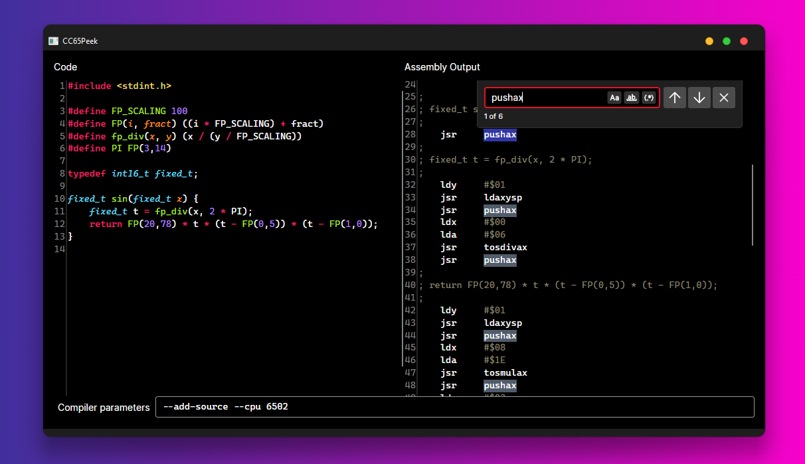

<h1 align="center">🎞 CC65Peek</h1>

CC65Peek is a simple utility that displays the Assembly output of the CC65 C compiler, similar to projects like the <a href="godbolt.org">Compiler Explorer</a>.

<a href="https://github.com/ascpixi/cc65peek/releases/latest/download/cc65peek-win-x64.exe"><code>download for windows</code></a> <a href="https://github.com/ascpixi/cc65peek/releases/latest/download/cc65peek-linux-x64.exe"><code>download for linux</code></a> <a href="https://github.com/ascpixi/cc65peek/releases/latest/download/cc65peek-macos-x64.exe"><code>download for macOS</code></a>

